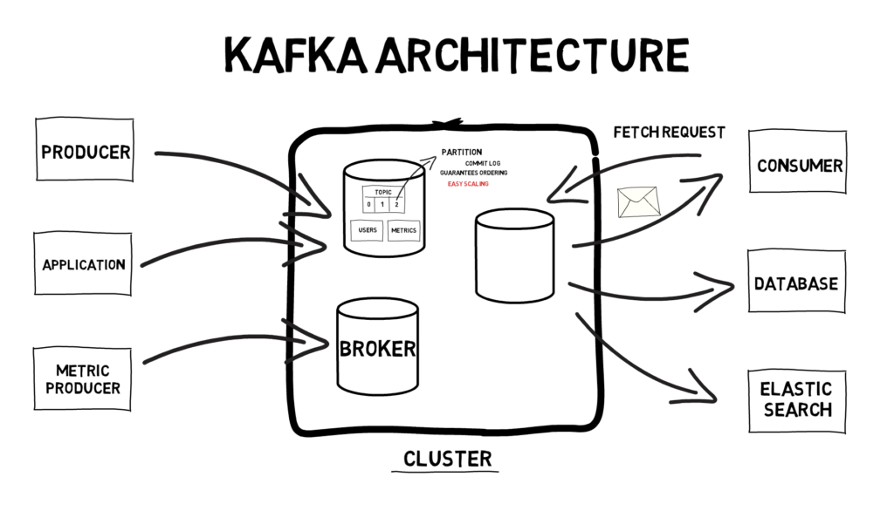

# GBFS Bike Monitoring

[](https://github.com/katwre/gbfs-bike-monitoring/actions/workflows/ci-cd.yml)
[](http://34.243.16.160:8501/)
[](http://34.243.16.160:8080/ui/main/flows)
[](http://34.243.16.160:9001/)


<figure>
<p align="center">
  
</p>
  <figcaption align="center"><b>Figure.</b> Intro to Kafka and scalable distributed systems. Figure copied from a <a href="https://finematics.com/apache-kafka-explained/">blog post</a>.</figcaption>
</figure>

--------------------------

My inspiration for this project is to explore data integration at scale through a systems lens. In both machine learning (ML) and computational biology, 
reliable modeling depends on timely, well-structured data from many sources. At small scale, point-to-point pipelines can work, but as the number of producers and consumers grows, integration complexity quickly becomes `O(N^2)` and difficult to maintain. `Kafka` addresses this by decoupling systems through a central event backbone: `producers` publish once, `consumers` subscribe as needed, and teams share a common interface for `real-time data exchange`. This project reflects my curiosity about applying `distributed data-engineering patterns` beyond traditional domains and learning how scalable streaming architectures can support analytics and ML workflows.

This project ingests GBFS bike station data every minute using Kestra, writes raw events to MinIO and Kafka, loads curated records into PostgreSQL, transforms them with dbt, and serves a two-tile Streamlit dashboard (dockerized with docker compose).

City-bike availability changes quickly, but raw GBFS feeds are not directly analytics-friendly. The goal is to build a reproducible pipeline that turns raw bike station events into dashboard-ready metrics for station availability distribution and time trends.

Dashboard preview:
1. Categorical tile: station counts by availability bucket (low/medium/high)
2. Temporal tile: bikes available over time


More info on urban sharing in Bergen:
- https://urbansharing.com/
- https://bergenbysykkel.no/en/


<p align="center">
  
</p>
  <figcaption align="center"><b>Figure.</b> Dashboard running on AWS EC2 provisioned with Terraform.</figcaption>
</figure>


> ⚠️ The live demo endpoint is ephemeral (AWS EC2). The recording above shows the deployed version.
> To reproduce, follow the [Cloud deployment](#cloud-deployment-aws--terraform) 
or [local deployment](#how-to-run-locally-with-docker) steps.

> This application was developed as part of the [Data engineering Zoomcamp](https://github.com/DataTalksClub/data-engineering-zoomcamp/tree/main) by [DataTalks.Club](https://datatalks.club/), a free course focused on building production-ready data pipelines.


## Tech stack

 • Docker Compose (to run services in one app stack)

 • Kafka + Zookeeper (event stream/message bus and ZooKeeper for metadata/coordination)

 • Kestra (orchestrator)

 • MinIO (data lake = raw storage)

 • PostgreSQL (warehouse) • SQL

 • dbt (data transformations)

 • Streamlit (visual dashboard) • plotly

 • Terraform on AWS (cloud deployment)

### Core MVP

The flow of the application:
```text
- GBFS
  ↓
- Kestra
  ↓
- Kafka + MinIO
  ↓
- Python consumer
  ↓
- Postgres
  ↓
- dbt
  ↓
- Streamlit (2 tiles: availability category and bikes of over time)
  ↓
- Cloud deployment (Terraform)
  ↓
  in progress
  ↓
- GitHub Actions (CI/CD)
```


## Data source
- GBFS root feed: https://gbfs.urbansharing.com/bergenbysykkel.no/gbfs.json
- Streaming endpoint: https://gbfs.urbansharing.com/bergenbysykkel.no/station_status.json
- Static metadata: https://gbfs.urbansharing.com/bergenbysykkel.no/station_information.json

I chose this dataset, because:
- No API key required
- JSON format
- Frequent updates (~10 seconds)
- Standardized GBFS schema

## Repository structure
```text
gbfs-bike-monitoring/
├── README.md
├── docker-compose.yml
├── app/
│   ├── consumers/
│   ├── loaders/
│   ├── models/
│   ├── producer_helpers/
│   └── utils/
├── dashboard/
│   ├── app.py
│   └── pages/
├── data/
│   └── sample/
├── dbt/
│   ├── models/
│   │   ├── staging/
│   │   └── marts/
│   └── profiles/
├── docs/
│   ├── architecture.md
│   └── diagrams/
├── infra/
│   └── terraform/
├── kestra/
│   └── flows/
├── sql/
│   ├── init/
│   └── queries/
└── tests/
```

## Cloud deployment (AWS + Terraform)

This project can be deployed to AWS using Terraform from `infra/terraform`. Great intro to terraform: https://www.youtube.com/watch?v=l5k1ai_GBDE.

Prerequisites:
- AWS credentials configured locally (for example via `aws configure`)
- An existing EC2 key pair in your target region
- Your repository pushed to GitHub/GitLab so EC2 can clone it

Deploy:
```bash
cd infra/terraform
cp terraform.tfvars.example terraform.tfvars
# edit terraform.tfvars with your key_name and repo_url
terraform init
# Check what Terraform wants to create:
terraform plan
# If the plan looks OK, create the infrastructure:
terraform apply
```

What to expect:
- Terraform creates:
  - 1 EC2 instance
  - 1 security group
- The VM boot script:
  - installs Docker
  - clones this github repo
  - runs docker compose up -d

After apply, Terraform outputs URLs for:
- Kestra (`:8080`)
- Streamlit (`:8501`)
- MinIO console (`:9001`)

Don't forget to destroy when done!!
```bash
terraform destroy
```

## CI/CD (GitHub Actions)

This repository includes a GitHub Actions workflow at `.github/workflows/ci-cd.yml`.

- CI runs on every push and pull request to `main`:
  - Python dependency install
  - Python syntax checks
  - Terraform format and validation checks

- CD is manual via **Actions → CI/CD → Run workflow**:
  - Always runs `terraform plan`
  - Runs `terraform apply` only if you set `deploy=true`

Required repository secrets:
- `AWS_ACCESS_KEY_ID`
- `AWS_SECRET_ACCESS_KEY`
- `AWS_REGION`
- `EC2_KEY_NAME`

## How to run locally with Docker

Start services:
```bash
docker-compose up -d
```

Check running containers:
```bash
docker-compose ps
```

Stop services:
```bash
docker-compose down
```

Local endpoints:
- Streamlit dashboard: http://localhost:8501
- Kestra: http://localhost:8080
- MinIO API: http://localhost:9000
- MinIO Console: http://localhost:9001
- pgAdmin: http://localhost:5050
- Postgres: localhost:5433
- Kafka broker: localhost:9092


### To run ingestion once and immediately:
Use the Python ingestor once to fetch current station status, save raw JSON to MinIO, and publish station events to Kafka:

In MinIO Console (`http://localhost:9001`, user: `minio`, password: `minio123`):
1. Create a bucket named `gbfs-raw`.

And then paste:
```bash
docker run --rm --network gbfs-bike-monitoring_default -v "$PWD":/work -w /work python:3.11-slim \
	bash -lc "pip install -r app/producer_helpers/requirements.txt && python app/producer_helpers/gbfs_to_minio_kafka.py"
```

Expected result: JSON output with `status: ok`, `object_key`, and `published_messages`.


<figure>
<p align="center">
  
</p>
  <figcaption align="center"><b>Figure.</b> A dashboard preview.</figcaption>
</figure>

### To run ingestion in a scheduled way with Kestra:

A Kestra flow scaffold is provided at [kestra/flows/gbfs_station_status_to_minio_kafka.yml](kestra/flows/gbfs_station_status_to_minio_kafka.yml).

Prerequisites:
- In MinIO Console (`http://localhost:9001`, user: `minio`, password: `minio123`): create a bucket named `gbfs-raw`

In Kestra UI:
1. Open `http://localhost:8080`
2. Create flow in namespace `gbfs`
3. Paste the YAML from the file above
4. Save and run (or keep schedule enabled)

This will poll every minute and push data to both MinIO and Kafka.

#### Load historical snapshots from MinIO into Postgres

Once Kestra has run a few times, load all raw snapshots from MinIO into the staging table:

```bash
docker run --rm --network gbfs-bike-monitoring_default -v "$PWD":/work -w /work python:3.11-slim \
  bash -lc "pip install sqlalchemy psycopg2-binary boto3 && python app/consumers/minio_to_postgres.py"
```

This reads every raw snapshot stored in MinIO and inserts station records into `staging.station_status_raw`.

#### Run dbt to build mart tables

```bash
docker run --rm --network gbfs-bike-monitoring_default -v "$PWD/dbt":/usr/app -w /usr/app python:3.11-slim bash -lc "apt-get update -qq && apt-get install -y git -qq && pip install dbt-postgres -q && dbt run --profiles-dir profiles"
```

This materializes `staging.stg_station_status`, `marts.mart_station_latest`, and `marts.mart_bikes_over_time`.

The Streamlit dashboard at `http://localhost:8501` will now show both tiles with real data.


